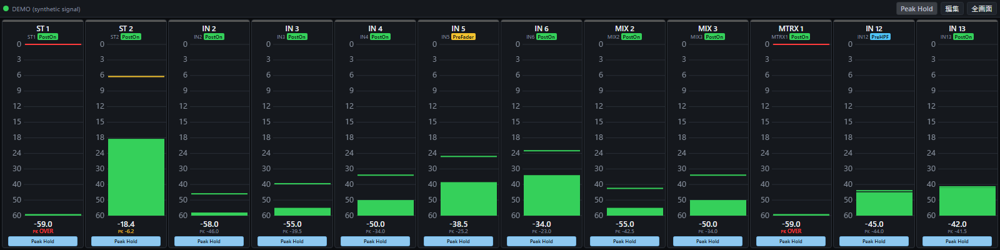

# DM7 External Meter

Yamaha DM7 / DM7 Compact のメーターを LAN 経由で読み取り、PC・タブレット・横長タッチディスプレイに表示するツールです。
DM7 Editor と同時に使えます (DM7 側の設定変更は不要)。

*An external meter bridge for the Yamaha DM7 series: reads channel / mix / matrix / stereo meters over the console's Remote Control Protocol (TCP 49280) and shows them in a touch-friendly web UI. Windows / macOS binaries are on the [Releases](../../releases) page; see the English notes at the bottom.*



## できること

- IN 72 / MIX 48 / MTRX 12 / ST の各メーターを、PreHPF (PreEQ) / PreFader / PostOn のポイント別に任意の枚数並べる
- 瞬時値とピーク値の数値表示、ch ごとの Peak Hold、ホールド時間、タップでピークリセット
- 同じ LAN の DM7 を自動検出。複数台あれば選択、前回の接続先を記憶
- ch 名・色は DM7 側で変えると即時に追従
- 編集モードでドラッグ & ドロップ、またはタップで追加。並び替え・差し替え・削除
- レイアウトはブラウザに保存。URL パラメータで初期レイアウトを指定できるのでキオスク運用向き
- 切断時は OFFLINE 表示と自動再接続

## 使い方 (実行ファイル版)

1. [Releases](../../releases) から自分の OS のファイルをダウンロードする
   - Windows: `dm7-external-meter-windows-x64.exe`
   - Mac (Apple Silicon): `dm7-external-meter-macos-arm64`
   - Mac (Intel): `dm7-external-meter-macos-x64`
2. PC を DM7 と同じネットワークに接続する
3. 実行する。黒いコンソール画面が開き、既定のブラウザで `http://127.0.0.1:8000/` が開く
4. DM7 が 1 台なら自動で接続。複数台なら選択画面が出るので接続先をタップする
5. 「編集」から表示したいメーターを追加する

終了はコンソール画面を閉じる (または Ctrl+C)。設定は実行ファイルと同じフォルダの `config.json` と、ブラウザ内に保存されます。

### 初回起動時の警告について

署名していないため、初回に OS の警告が出ます。

- **Windows**: 「Windows によって PC が保護されました」→「詳細情報」→「実行」
- **Mac**: ダウンロード後にターミナルで実行属性と隔離属性を外す
  ```
  chmod +x ~/Downloads/dm7-external-meter-macos-arm64
  xattr -d com.apple.quarantine ~/Downloads/dm7-external-meter-macos-arm64
  ~/Downloads/dm7-external-meter-macos-arm64
  ```
  または Finder で右クリック → 「開く」。初回に「ネットワーク受信接続を許可しますか」と聞かれたら許可する
- ウイルス対策ソフトが PyInstaller 製の実行ファイルを誤検知することがあります。気になる場合は下の「ソースから動かす」を使ってください

### 起動オプション

コンソール (コマンドプロンプト / ターミナル) から引数を付けて起動できます。

| オプション | 意味 |
|---|---|
| `--host 192.168.x.x` | DM7 の IP を固定 (自動検出しない) |
| `--bind-ip 192.168.x.x` | DM7 へ繋ぐ NIC をこの PC の IPv4 で固定。自動検出の範囲もその NIC のサブネットだけになる |
| `--listen 0.0.0.0` | LAN 内の他の端末 (タブレット等) からも `http://<この PC の IP>:8000/` で見られるようにする (既定)。`127.0.0.1` でこの PC だけに限定 |
| `--port 8000` | Web UI のポート |
| `--interval 50` | メーター更新間隔 ms (40〜1000) |
| `--no-browser` | 起動時にブラウザを開かない (キオスク用) |
| `--forget` | 記憶した接続先を無視して再スキャン |
| `--scan` | 見つかった DM7 を一覧して終了 |
| `--list-nics` | この PC の IPv4 一覧 |

### URL パラメータ

- `?slots=St:1:PostOn,InCh:17:PostOn:0,Mix:7:PreFader` : 表示するメーターを指定 (ソース:ch 番号:ポイント、4 つ目の `:0` でその ch の Peak Hold を OFF)。指定はブラウザに保存される
- `?demo=1` : DM7 無しで合成信号を表示 (UI の確認用)
- `?fps=30` / `?dpr=1` : 低性能機 (ラズパイ等) 向けに描画レートと描画解像度を抑える

## 画面の操作

- **メーターをタップ** → ソース・ポイント・ch を選んで差し替え。ポイントのタブは押した瞬間に同じ ch のまま切り替わる。「このメーターを外す」で削除
- **数値 (瞬時値 / PK) をタップ** → その ch のピークをリセット
- **Peak Hold ボタン** → その ch のピークホールド ON / OFF
- **上部 Peak Hold** → 全 ch を一括で ON / OFF、ホールド時間 (±1 秒、直接入力 0.1 秒刻み、0〜60 秒)、全ピークリセット
- **上部の機器名をタップ** → DM7 の一覧・再スキャン・切替
- **編集** → 編集モード。ch タイルをタップで右端に追加、メーターの上に落とすと差し替え、隙間に落とすと挿入。メーターを掴んで横に動かすと並び替え、引き出しへ落とすか × で削除。「完了」で戻る。通常モードではドラッグは効かない (誤操作防止)
- ポイントの色分け: PreHPF / PreEQ = 水色、PreFader = 琥珀、PostOn = 緑

## ソースから動かす (Windows / macOS / Linux 共通)

```
git clone https://github.com/watatatata810/Tools_DM7-ExternalMeter.git
cd Tools_DM7-ExternalMeter
python3 -m venv .venv && source .venv/bin/activate     # Windows は .venv\Scripts\activate
pip install -r bridge/requirements.txt
python3 bridge/server.py
```

Python 3.9 以上。実行ファイルは `pip install pyinstaller && pyinstaller packaging/dm7meter.spec` で作れます (`dist/` に出力)。

## ラズパイでキオスク運用する場合

描画は 1 メーター 1 canvas を `requestAnimationFrame` で更新し、レイアウト読み取りを含まない (サイズは `ResizeObserver`、目盛はサイズごとにキャッシュ、値が変わらないメーターは描かない)。PC 実測で 36 本表示時のレイアウト計算は 59 回/秒、スクリプト時間は 1 コアの 12% (Chrome ヘッドレス)。Pi では `?fps=30&dpr=1` を付けると更に軽くなる。

Raspberry Pi OS にソースを置き、`bridge/server.py --no-browser --listen 127.0.0.1` を systemd で常駐、Chromium を `--kiosk http://127.0.0.1:8000/?slots=...` で自動起動する構成を想定しています。ディスプレイは HDMI + USB タッチのものを選んでください。

## 仕組み・仕様メモ

```
DM7 ──(RCP, TCP 49280)── bridge/server.py ──(WebSocket)── web/index.html
```

- メーター値は DM7 本体が計算した値そのもの (バリスティクスは本体と同じ)。ピークホールドだけ UI 側 (既定 3 秒保持後 20 dB/s で落下)
- DM7 はメーター配信を `mtrstart` から 10 秒で自動停止するため、ブリッジが 5 秒ごとに再送している
- 更新間隔は 50 ms が実測上限。未選択のメーターは購読しないので DM7 と LAN への負荷は最小
- 生値 (8bit) → dB の換算表は Companion の Yamaha RCP モジュール由来で、DM7C の内蔵オシレーター 8 点で校正済み ([tools/calibration_log.csv](tools/calibration_log.csv))。-30 dB の目盛境界だけ 1 段 (0.5 dB) 下に出る
- 目盛は DM7 Editor と同じ刻み (0 / 3 / 6 / 9 / 12 / 15 / 18 / 24 / 30 / 40 / 50 / 60)。色分けの閾値 (黄 -18 dB 以上) は仮置き
- ch が OFF のとき PostOn は無信号になる。ch 名・色の変更は RCP の `NOTIFY set` で即時追従、シーンリコール時は全件取り直し
- オフライン時: 受信が 15 秒途絶えると切断扱い。メーターは床値に落ちて OFFLINE 表示、2 → 4 → 7 → 10 秒間隔で再接続。30 秒以上復帰しなければ自動で再スキャンして選択画面を出す (別の機器へ自動では切り替えない)
- 自動検出はこの PC の NIC のサブネット (最大 /22) へ TCP 49280 を並列接続して `devinfo` で確認 (実測 /24 で約 1.2 秒、全体 8 秒で打ち切り)。管理されたネットワークでは `--host` 指定を推奨

### 換算表を再校正する

DM7 Editor の Monitor > Oscillator で入力 ch に 1 kHz を入れ、各レベルで次を実行すると `tools/calibration_log.csv` に追記されます。

```
python3 tools/rcp_calibrate.py -20 24      # -20 dBFS を ch24 に入れている場合
```

## ライセンス

MIT License。第三者由来の部分は [THIRD_PARTY_NOTICES.md](THIRD_PARTY_NOTICES.md) を参照。Yamaha および DM7 はヤマハ株式会社の商標です。本プロジェクトはヤマハとは無関係です。

---

## English notes

**What it does** — Connects to a Yamaha DM7 / DM7 Compact over the Remote Control Protocol (TCP 49280, works alongside DM7 Editor), subscribes to the meters you display (InCh 72 / Mix 48 / Mtrx 12 / St; PreHPF-PreEQ / PreFader / PostOn) and renders them in a touch-friendly web page: instant + peak readouts, per-channel peak hold, hold time, tap-to-reset, drag & drop layout editing, automatic console discovery on the local subnet, live label/colour updates, offline handling with automatic reconnect.

**Run** — Download the binary for your OS from Releases and run it; the UI opens at `http://127.0.0.1:8000/`. Unsigned binaries: on Windows choose "More info → Run anyway"; on macOS run `chmod +x` and `xattr -d com.apple.quarantine` on the file (or right-click → Open). Options: `--host`, `--bind-ip`, `--listen`, `--port`, `--interval`, `--no-browser`, `--forget`, `--scan`, `--list-nics`. From source: `pip install -r bridge/requirements.txt && python3 bridge/server.py` (Python 3.9+).

**Notes** — Meter values are the console's own (same ballistics); the 8-bit `levelwt` → dB table comes from the Bitfocus Companion Yamaha RCP module and was verified with the DM7C oscillator at eight levels. The DM7 stops a meter stream 10 s after `mtrstart`, so the bridge re-arms every 5 s. Not affiliated with Yamaha.
